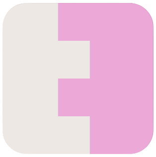

  &nbsp;

A privacy layer for 0G Chain. Private token transfers with Zero-Knowledge proofs.

---

## What is StealthPay?

StealthPay lets anyone shield tokens into a private pool, transfer privately between wallets, and unshield back to a public address — all on 0G Chain. Privacy is enforced by ZK proofs generated entirely client-side. No trusted server. No TEE. No trusted setup.

The chain only ever sees: *"a valid private action happened."* Amounts, senders, and receivers stay hidden inside encrypted notes stored on 0G Storage.

---

## How It Works

**Shield — public → private**

The user approves and deposits tokens into the PrivacyPool contract. The SDK generates a ZK proof that the commitment equals `Poseidon2(pubkey, token, amount, salt)`. The contract verifies the proof, pulls the tokens, and inserts the commitment into an on-chain Merkle tree.

**Private Transfer — private → private**

The SDK selects input notes, fetches their Merkle inclusion paths, and generates a spend proof: Merkle membership + correct nullifier derivation + value conservation. The contract verifies the proof, marks the nullifiers spent, and inserts new commitments for the receiver and change. The receiver's encrypted note is stored in 0G Storage. The explorer sees one generic event — no amounts, no addresses.

**Unshield — private → public**

The SDK generates a spend proof with a public output amount and a recipient address. The contract verifies the proof, marks the nullifier spent, and releases tokens to the recipient. The explorer sees: `PrivacyPool → RecipientAddress : N USDC`.

---

## Components

| Folder | Description | |
|---|---|---|
| [`contracts/`](contracts/) | Solidity — PrivacyPool, ZK verifiers, Poseidon2 Merkle tree | [README](contracts/README.md) |
| [`circuits/`](circuits/) | Noir ZK circuits — shield and spend proofs (UltraHonk / Barretenberg) | |
| [`sdk/`](sdk/) | TypeScript SDK — client-side proof generation, note management, 0G Storage sync | [README](sdk/README.md) |
| [`frontend/`](frontend/) | Next.js app — explorer, playground, docs | [README](frontend/README.md) |
| [`engine/`](engine/) | V1 TEE reference (not used in production) | [README](engine/README.md) |
